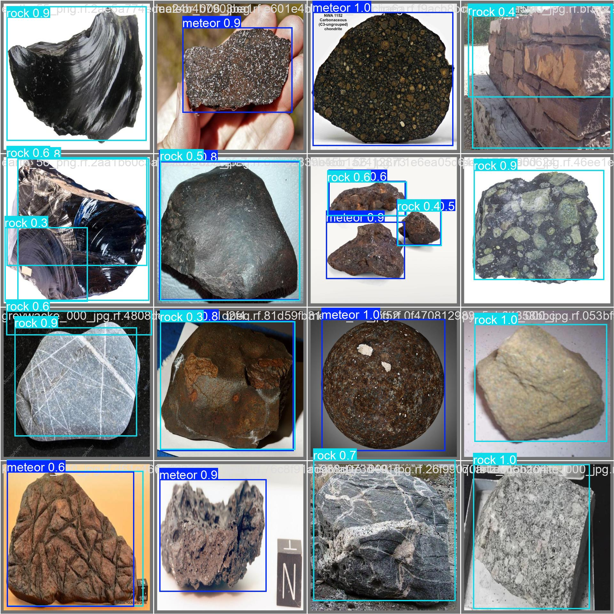
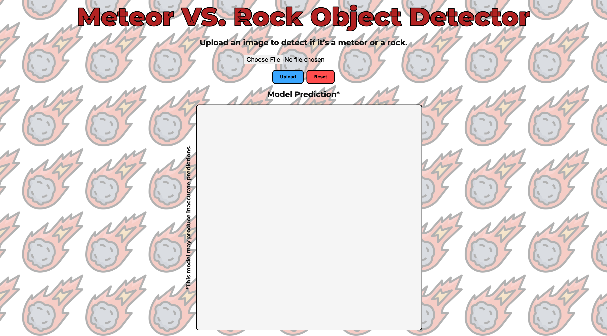

  

# Rock vs. Meteor Detector - Flask App

### Detect Meteorites vs. Rocks in uploaded images using a YOLOv11 model trained on the [Meteor vs. Rock Dataset](https://universe.roboflow.com/aiprojects-jxzlb/merged_meteorvsrock) 

---

### Model

**Architecture:** YOLOv11 - [YOLO11n](https://github.com/ultralytics/assets/releases/download/v8.3.0/yolo11n.pt) from (Ultralytics)  
**Task:** Binary detection – Meteor vs. Rock  
**Dataset:** [Roboflow Universe – Meteor vs Rock](https://universe.roboflow.com/aiprojects-jxzlb/merged_meteorvsrock) Annotated using Bounding Boxes  
***Important**: This model was trained on a limited dataset and may produce incorrect predictions. To make the model more accurate additional training on new set of data is required.*

[](https://colab.research.google.com/drive/1mLRNMBEYXMUzxI1bSIEYrhYiUlO_TvN2?usp=drive_link)

---

### Model Metrics and Evaluations

**Performance metrics from last training (mAP, precision/recall, confusion matrix).**

*Image 1: training and validation metrics*

**Confusion matrix from last training**

*Image 2: confusion matrix results*

**Prediction outputs from evaluation's last training**

*Image 3: evaluation results*

> Note: More detailed training results files on the model available in **model/YOLO_BBoxMeteorRockDetector_Final_20_jul/detect/meteor_rock_detector/**

---

### Docker

Clone project:
```shell
git clone https://github.com/RudzC/rock-vs-meteor-detector.git && cd rock-vs-meteor-detector
```

Build image:
```shell
docker build -t meteorite_vs_rock_object_detection:latest --build-arg INSTALL_MODE=cpu .
```
            
Run container:
```shell
docker run -d --cpus 1.0 -p 4000:80 --name meteorite_vs_rock_object_detection --restart unless-stopped meteorite_vs_rock_object_detection
```

*View the app at: http://localhost:4000/*

Clone, Build and Run on **GPU** (Optional):
```shell
git clone https://github.com/RudzC/rock-vs-meteor-detector.git && cd rock-vs-meteor-detector
docker build -t meteorite_vs_rock_object_detection:gpu --build-arg INSTALL_MODE=gpu .
docker run --rm --gpus all -p 4000:80 --name meteor-rock meteorite_vs_rock_object_detection:gpu
```

*View the app at: http://localhost:4000/*

**Notes:** The `INSTALL_MODE` argument accepts:
- `"cpu"` **default** + **recommended** - for running the app in CPU-only environments
- `"gpu"` - for CUDA-enabled environments 

*Use the provided shell command examples for Cloning/Building/Running a functional working version of the App.*

**Optionally:** Run Without Docker

```shell
python -m venv .venv && source .venv/bin/activate
pip install -r requirements.txt
python app.py
```
Go to: http://localhost:4000

### App Usage

1. Navigate and load application in browser using the above provided local URL.

2. On the home page click on the choose file input form and select an image containing the Meteorite or Rock that you wish the model to classify
3. After selecting the desired image click the upload button to run the model prediction. A green alert will be displayed on successful uploads.
4. It may take a few seconds then an image should be displayed showcasing the models' prediction label and accuracy score.


- **Reset Action**: The reset button can be used to reset the Input and Output displayed on the screen.*


---

### CI/CD (GitHub Actions → Oracle Cloud VM)

This repository includes a deployment workflow using [appleboy/ssh-action](https://github.com/appleboy/ssh-action) to build and run the Docker image on an Oracle Compute Instance.

**Required repository secrets:**
- `HOST` – the public IP or hostname of your running instance
- `SSH_KEY` – the private key for the `ubuntu` user (no passphrase)

Pushing to the `master` branch triggers the workflow.  
The workflow connects via SSH, pulls the latest code, builds the Docker image, and starts the container bound to port 80 on the VM.

**Live Demo:** [Rock vs. Meteor Detector – Flask App](http://158.180.235.149/)

> **Important Notes**: 
> - The deploy-master.yml currently configured for CPU. Make sure to use the proper docker commands when switching to GPU.
> - Docker should be installed on .

---

### Licenses for Dependencies

Below are the licenses for the main dependencies used in this project. For each has been provided the package name, version, GitHub repository, and its license type.

---

**flask~=3.1.0**  
- [GitHub: pallets/flask](https://github.com/pallets/flask)  
- License: [BSD-3-Clause](https://github.com/pallets/flask/blob/main/LICENSE.rst)

---

**numpy~=1.26.4**  
- [GitHub: numpy/numpy](https://github.com/numpy/numpy)  
- License: [BSD-3-Clause](https://github.com/numpy/numpy/blob/main/LICENSE.txt)

---

**ultralytics~=8.3.177**  
- [GitHub: ultralytics/yolov5](https://github.com/ultralytics/yolov5)  
- License: [GNU Affero General Public License v3.0 (AGPL-3.0)](https://github.com/ultralytics/yolov5/blob/master/LICENSE)

---

**torch~=2.8.0**  
- [GitHub: pytorch/pytorch](https://github.com/pytorch/pytorch)  
- License: [BSD-3-Clause](https://github.com/pytorch/pytorch/blob/main/LICENSE)

---

**pillow~=11.2.1**  
- [GitHub: python-pillow/Pillow](https://github.com/python-pillow/Pillow)  
- License: [HPND](https://github.com/python-pillow/Pillow/blob/main/LICENSE)  
  *(Historical Permission Notice and Disclaimer; similar to MIT/FreeBSD)*

---

**opencv-python-headless==4.10.0.84**  
- [GitHub: opencv/opencv-python](https://github.com/opencv/opencv-python)  
- License: [MIT License](https://github.com/opencv/opencv-python/blob/main/LICENSE)

---

**gunicorn**  
- [GitHub: benoitc/gunicorn](https://github.com/benoitc/gunicorn)  
- License: [MIT License](https://github.com/benoitc/gunicorn/blob/master/LICENSE)

---

